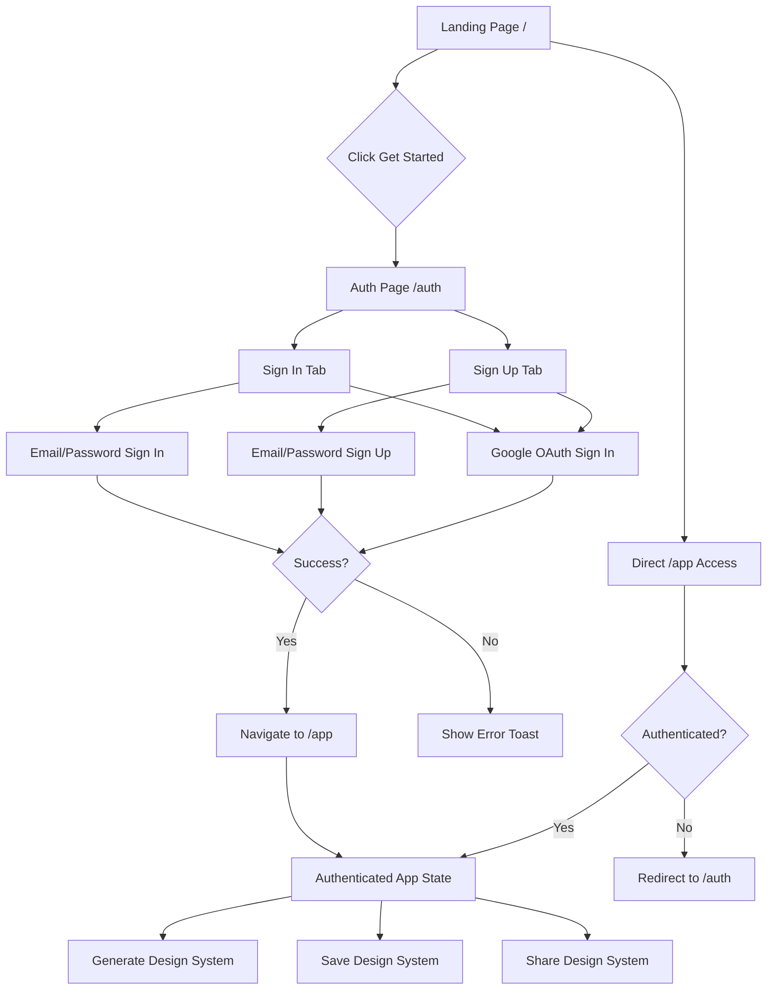
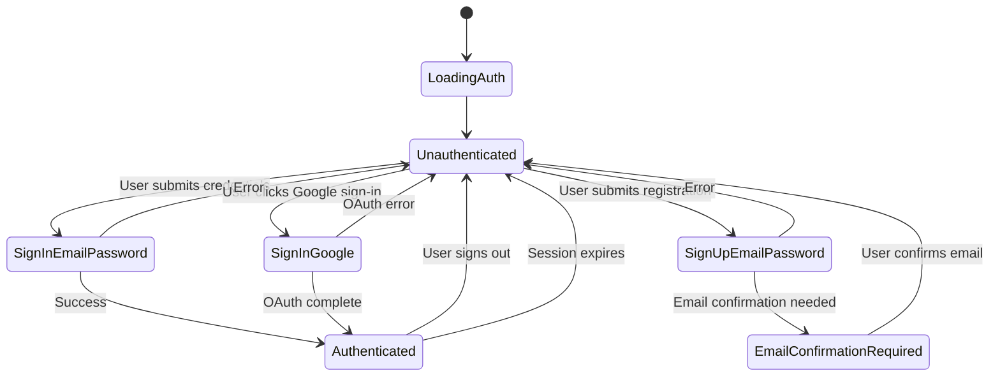

# Authentication and Application Flow Review
**Design System Application**
**Review Date:** February 3, 2026
**Reviewer:** Architect Mode Analysis

---

## Executive Summary

This review analyzes the complete user authentication journey and application flow for the Design System application, examining sign-in/sign-up flows, session management, protected routes, state handling, and all major application state transitions. The analysis identifies critical gaps and broken paths that would prevent users from successfully completing their journey from authentication to end-to-end usage.

**Overall Assessment: CRITICAL GAPS IDENTIFIED - Several broken paths in authentication flow**

---

## 1. User Journey Flow Analysis

### 1.1 Complete User Journey Diagram



### 1.2 Application States

| State | Location | Description |
|-------|----------|-------------|
| **Unauthenticated - Landing** | `/` | Public landing page, accessible to all |
| **Unauthenticated - Auth** | `/auth` | Sign in/sign up page |
| **Unauthenticated - App** | `/app` | Redirects to `/auth` if not authenticated |
| **Authenticated - App** | `/app` | Full application access |
| **Shared Design View** | `/share/:id` | Read-only view of shared design |
| **Public Docs View** | `/docs/:shareId` | Read-only documentation view |
| **Error State** | `*` | 404 Not Found page |

---

## 2. Authentication Implementation Analysis

### 2.1 AuthContext Implementation

**File:** [`src/contexts/AuthContext.tsx`](src/contexts/AuthContext.tsx)

| Aspect | Implementation | Status |
|--------|---------------|--------|
| **Session Management** | Supabase `onAuthStateChange` listener | ✅ Good |
| **User State** | React state with useEffect | ✅ Good |
| **Loading State** | Boolean state for auth initialization | ✅ Good |
| **Sign Up** | `supabase.auth.signUp` with email redirect | ⚠️ Issues |
| **Sign In** | `supabase.auth.signInWithPassword` | ✅ Good |
| **Google OAuth** | `supabase.auth.signInWithOAuth` | ⚠️ Issues |
| **Sign Out** | `supabase.auth.signOut` | ✅ Good |

### 2.2 Critical Issues Identified

#### Issue 1: Missing Email Confirmation Handling
**Severity:** Critical  
**Location:** [`AuthContext.tsx:40-48`](src/contexts/AuthContext.tsx:40)

```typescript
const signUp = async (email: string, password: string) => {
  const redirectUrl = `${window.location.origin}/`;
  const { error } = await supabase.auth.signUp({
    email,
    password,
    options: { emailRedirectTo: redirectUrl },
  });
  return { error: error as Error | null };
};
```

**Problem:** 
- When email confirmation is required, the user is not informed
- No handling for "email confirmation sent" state
- User may sign up and never receive feedback about confirming email

**Impact:** Users may think sign-up failed and abandon the application

**Recommendation:**
```typescript
const signUp = async (email: string, password: string) => {
  const redirectUrl = `${window.location.origin}/`;
  const { data, error } = await supabase.auth.signUp({
    email,
    password,
    options: { emailRedirectTo: redirectUrl },
  });
  
  if (error) {
    return { error: error as Error | null };
  }
  
  // Check if email confirmation is required
  if (data.session === null && data.user?.email_confirmed_at === null) {
    // Email confirmation required - return special status
    return { error: null, needsConfirmation: true };
  }
  
  return { error: null };
};
```

#### Issue 2: Google OAuth Redirect Issue
**Severity:** Critical  
**Location:** [`AuthContext.tsx:55-63`](src/contexts/AuthContext.tsx:55)

```typescript
const signInWithGoogle = async () => {
  const { error } = await supabase.auth.signInWithOAuth({
    provider: 'google',
    options: {
      redirectTo: `${window.location.origin}/`,
    },
  });
  return { error: error as Error | null };
};
```

**Problem:**
- After OAuth flow completes, user is redirected to `/` (root)
- Should redirect to `/app` instead for authenticated users
- No handling for OAuth callback state

**Impact:** Users must manually navigate to `/app` after Google sign-in

**Recommendation:**
```typescript
const signInWithGoogle = async () => {
  const { error } = await supabase.auth.signInWithOAuth({
    provider: 'google',
    options: {
      redirectTo: `${window.location.origin}/app`,
    },
  });
  return { error: error as Error | null };
};
```

#### Issue 3: No Session Refresh Handling
**Severity:** Medium  
**Location:** [`AuthContext.tsx`](src/contexts/AuthContext.tsx)

**Problem:**
- No explicit session refresh mechanism
- Relies on Supabase's autoRefreshToken, but no error handling for expired sessions
- When token expires, users may be stuck in authenticated state without knowing

**Impact:** Users may lose data or have broken experiences when sessions expire

---

## 3. Routing Architecture Analysis

### 3.1 Route Configuration

**File:** [`src/App.tsx`](src/App.tsx:31-42)

```typescript
<Routes>
  <Route path="/" element={<Landing />} />
  <Route path="/auth" element={<Auth />} />
  <Route path="/share/:id" element={<SharedDesign />} />
  <Route path="/docs/:shareId" element={<PublicDocViewer />} />
  <Route path="/app" element={<Index />} />
  <Route path="*" element={<NotFound />} />
</Routes>
```

### 3.2 Protected Route Issues

#### Issue 4: No Route Guards for /app
**Severity:** Critical  
**Location:** [`src/App.tsx:37`](src/App.tsx:37)

**Problem:**
- `/app` route has no authentication guard
- Relies on `AuthRequiredWrapper` component inside Index page
- Users can navigate directly to `/app` before auth completes
- No redirect logic at routing level

**Impact:** 
- Unauthenticated users see authenticated-only content
- May expose internal application state
- Poor user experience

**Recommendation - Implement Route Guard:**
```typescript
const ProtectedRoute = ({ children }: { children: ReactNode }) => {
  const { user, loading } = useAuth();
  
  if (loading) {
    return <LoadingSpinner />;
  }
  
  if (!user) {
    return <Navigate to="/auth" replace />;
  }
  
  return children;
};

// Usage
<Route path="/app" element={
  <ProtectedRoute>
    <Index />
  </ProtectedRoute>
} />
```

#### Issue 5: Auth Page Auto-Redirect
**Severity:** Medium  
**Location:** [`src/pages/Auth.tsx:22-26`](src/pages/Auth.tsx:22)

```typescript
useEffect(() => {
  if (user) {
    navigate("/app");
  }
}, [user, navigate]);
```

**Problem:**
- Works correctly for email/password sign-in
- May not work correctly for OAuth flow (redirect happens before state updates)
- Creates race condition with route guard (if implemented)

**Impact:** Users may see brief flash of auth page during OAuth flow

---

## 4. State Management Analysis

### 4.1 Auth State Flow



### 4.2 State Issues

#### Issue 6: No Auth Loading State in UI
**Severity:** Low  
**Location:** Multiple components

**Problem:**
- `loading` state from AuthContext is available but not consistently used
- Components show no loading indicator during auth operations
- Users may double-click buttons thinking action didn't work

**Impact:** Poor user experience during authentication

---

## 5. Application Flow Gaps

### 5.1 Broken Paths Identified

#### Gap 1: Email Confirmation Flow
**Severity:** Critical  
**Path:** Sign Up → Email Confirmation → App Access

**Current Behavior:**
1. User signs up with email/password
2. If email confirmation required, no feedback provided
3. User redirected to success message but can't access app
4. No instruction to check email or confirm

**Expected Behavior:**
1. User signs up with email/password
2. System shows "Please check your email to confirm"
3. User confirms via email link
4. User redirected to app (if using email redirect)
5. User can sign in with credentials

**Current Issue:** Step 4 and 5 may not work correctly

#### Gap 2: OAuth Post-Login Flow
**Severity:** High  
**Path:** Google Sign In → Redirect → App

**Current Behavior:**
1. User clicks Google sign-in
2. OAuth window opens and completes
3. User redirected to `/` (root)
4. User must manually navigate to `/app`

**Expected Behavior:**
1. User clicks Google sign-in
2. OAuth window opens and completes
3. User redirected directly to `/app`
4. User sees authenticated app state immediately

#### Gap 3: Session Expired Flow
**Severity:** Medium  
**Path:** Authenticated Session → Session Expires → Recovery

**Current Behavior:**
1. User is authenticated
2. Session token expires (silently)
3. User continues using app
4. API calls start failing
5. No clear error or redirect

**Expected Behavior:**
1. User is authenticated
2. Session token about to expire
3. System attempts refresh silently
4. If refresh fails, show session expired message
5. Redirect to /auth for re-authentication

#### Gap 4: Protected Route Bypass
**Severity:** Critical  
**Path:** Direct URL Access → Protected Route

**Current Behavior:**
1. User directly navigates to `/app` without auth
2. Index page loads but shows AuthRequiredWrapper
3. User sees "Sign In to Unlock" UI
4. User must click sign in button
5. Navigates to `/auth`

**Expected Behavior:**
1. User directly navigates to `/app` without auth
2. Route guard detects unauthenticated
3. Immediately redirects to `/auth`
4. After sign in, redirects back to `/app`

---

## 6. API Integration Review

### 6.1 Supabase Client Configuration

**File:** [`src/integrations/supabase/client.ts`](src/integrations/supabase/client.ts)

| Aspect | Configuration | Status |
|--------|--------------|--------|
| **URL/Key** | Environment variables | ✅ Good |
| **Auth Storage** | localStorage | ✅ Good |
| **Session Persistence** | `persistSession: true` | ✅ Good |
| **Token Refresh** | `autoRefreshToken: true` | ✅ Good |

### 6.2 Database Schema Issues

**File:** [`src/integrations/supabase/types.ts`](src/integrations/supabase/types.ts)

| Table | Issue | Severity |
|-------|-------|----------|
| `design_systems` | `share_id` nullable but not consistently used | Low |
| `design_systems` | No RLS policies defined in types | Medium |
| `design_tokens` | `group_id` can be null without validation | Low |

---

## 7. Specific Recommendations

### 7.1 Critical Priority (Must Fix)

| Issue | Recommendation | Effort |
|-------|----------------|--------|
| No route guard for /app | Implement ProtectedRoute component | Low |
| OAuth redirect to root | Change redirectTo to `/app` | Low |
| No email confirmation handling | Add needsConfirmation return value | Medium |
| No session expiry handling | Add session refresh and expiry detection | Medium |

### 7.2 High Priority (Should Fix)

| Issue | Recommendation | Effort |
|-------|----------------|--------|
| Loading state in Auth page | Show spinner during auth operations | Low |
| Toast messages for OAuth errors | Improve error handling in handleGoogleSignIn | Low |
| Supabase environment variables | Add validation for required env vars | Low |

### 7.3 Medium Priority (Nice to Have)

| Issue | Recommendation | Effort |
|-------|----------------|--------|
| Remember me functionality | Add checkbox for session persistence | Medium |
| Password strength indicator | Visual feedback on password strength | Medium |
| Social login options | Add more OAuth providers | Medium |

---

## 8. User Journey Testing Checklist

| Test Case | Steps | Expected Result | Current Status |
|-----------|-------|-----------------|----------------|
| **Email Sign In** | Landing → Sign In → Enter credentials → Submit | Redirect to /app, authenticated | ✅ Works |
| **Email Sign Up** | Landing → Sign Up → Enter credentials → Submit | Account created, email confirmation | ❌ Broken |
| **Google Sign In** | Landing → Google Sign In → Complete OAuth | Redirect to /app, authenticated | ⚠️ Partial |
| **Direct /app Access** | Navigate directly to /app | Redirect to /auth | ❌ Broken |
| **Session Expiry** | Let session expire while using app | Show expired message, redirect | ❌ Broken |
| **Sign Out** | Click sign out button | Redirect to landing, unauthenticated | ✅ Works |
| **Shared Design** | Open /share/:id link | View shared design, no auth required | ✅ Works |
| **Email Confirm Link** | Click email confirmation link | Redirect to app, authenticated | ⚠️ Unclear |

---

## 9. Conclusion

The authentication implementation has several critical gaps that would prevent users from successfully completing their journey:

1. **Critical:** No route protection for `/app` allows unauthenticated access
2. **Critical:** Email confirmation flow is not properly handled
3. **High:** OAuth redirect goes to wrong page
4. **Medium:** No session expiry detection or recovery

**Recommendation:** Block production deployment until these issues are resolved. The authentication flow is the foundation of the application, and these gaps would cause user abandonment and support overhead.

---

*Review completed on February 3, 2026*
*Related Document: [PRODUCTION_REVIEW.md](PRODUCTION_REVIEW.md)*
