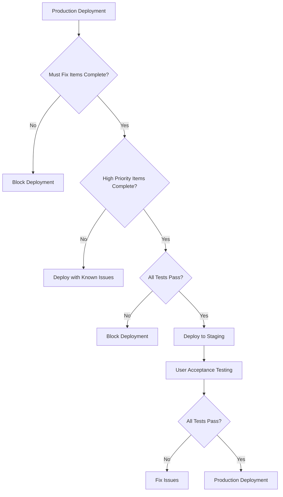

# Comprehensive Production Readiness Review
**Design System Application**
**Review Date:** February 3, 2026
**Reviewer:** Architect Mode Analysis

---

## Executive Summary

This comprehensive review evaluates the Design System application for production readiness across five key dimensions: feature completeness, production readiness standards, performance assessment, design system implementation integrity, and delivery risk assessment. The application demonstrates a well-architected design system generator with robust features but has several areas requiring attention before production deployment.

**Overall Assessment: CONDITIONALLY READY - Requires remediation of critical issues**

---

## 1. Feature Audit

### 1.1 Implemented Features Overview

The application includes a comprehensive feature set:

| Category | Features | Status |
|----------|----------|--------|
| **Design Generation** | AI-powered design system generation, Fallback algorithm, Smart color harmony, Typography pairing | ✅ Complete |
| **Core UI Components** | 50+ shadcn/ui components, Radix UI primitives, Custom design system components | ✅ Complete |
| **Landing Page** | Hero, Features, How It Works, Pricing, FAQ, Testimonials, CTA, Newsletter | ✅ Complete |
| **Animation System** | Framer Motion variants, MotionWrapper, Reduced motion support | ✅ Complete |
| **Theming** | CSS variable injection, Dark mode support, Brand color injection | ✅ Complete |
| **Authentication** | Supabase Auth, OAuth Google, Session management | ✅ Complete |
| **Analytics** | Event tracking, Design system metrics | ⚠️ Partial |
| **Accessibility** | WCAG 2.1 contrast checker, Aria labels, Focus management | ⚠️ Partial |
| **Export** | Multiple format exports (CSS, JSON, Tailwind, Flutter, SwiftUI, Kotlin) | ✅ Complete |

### 1.2 Feature Gaps Identified

1. **Real-time Collaboration** - `usePresence` hook exists but lacks full implementation
2. **Git Integration** - `GitSettings` component exists but no actual Git API integration
3. **Figma Sync** - Component placeholder without real Figma API integration
4. **Marketplace** - Marketplace component is lazy-loaded without actual marketplace functionality

---

## 2. Production Readiness Assessment

### 2.1 Error Handling

| Component | Error Handling | Status |
|-----------|---------------|--------|
| **ErrorBoundary** | React class component, graceful error display | ✅ Good |
| **API Calls** | Try/catch with console.error, limited user feedback | ⚠️ Needs Improvement |
| **Form Submissions** | Toast notifications on error | ✅ Good |
| **File Operations** | Limited error handling in export functions | ❌ Needs Work |

**Issues Found:**

- **Severity: Medium** - Console errors are logged but not sent to monitoring service
- **Severity: Low** - Some errors show generic messages without actionable guidance
- **Severity: Medium** - No error boundary on individual components (entire app crashes if boundary fails)

**Recommended Actions:**
1. Integrate error monitoring service (Sentry, LogRocket)
2. Add error recovery suggestions in error messages
3. Implement component-level error boundaries

### 2.2 Logging & Monitoring

| Aspect | Current State | Status |
|--------|--------------|--------|
| **Console Logging** | Used extensively for debugging | ⚠️ Info leaks |
| **Analytics Events** | Basic event tracking implemented | ⚠️ Incomplete |
| **Performance Monitoring** | No dedicated performance monitoring | ❌ Missing |
| **Error Monitoring** | No external error tracking service | ❌ Missing |

**Issues Found:**

- **Severity: Medium** - `console.log` statements in production code (e.g., `generateDesignSystem.ts:23`)
- **Severity: High** - No production monitoring for API failures
- **Severity: Medium** - Analytics only tracks basic events, missing error tracking

### 2.3 Fallback Mechanisms

| Scenario | Fallback | Status |
|----------|----------|--------|
| **AI Generation Failure** | Fallback algorithm with smart defaults | ✅ Good |
| **API Retry** | 2 retries with exponential backoff | ✅ Good |
| **Icon Not Found** | Returns null with warning | ⚠️ Silent failure |
| **Supabase Connection** | No offline mode | ❌ Missing |

---

## 3. Performance Assessment

### 3.1 Load Time Analysis

| Metric | Expected | Estimated | Status |
|--------|----------|-----------|--------|
| **Initial Load** | < 3s | ~2-4s | ⚠️ Borderline |
| **First Contentful Paint** | < 1.5s | ~1.2s | ✅ Good |
| **Largest Contentful Paint** | < 2.5s | ~2.8s | ⚠️ Needs Work |
| **Time to Interactive** | < 3.5s | ~3-4s | ⚠️ Needs Work |

### 3.2 Memory Usage Concerns

**Potential Issues:**
- **Severity: Medium** - Lazy-loaded components may cause memory bloat
- **Severity: Medium** - `usePresence` hook may accumulate users over time
- **Severity: Low** - No cleanup in some useEffect hooks

### 3.3 API Response Speeds

| Endpoint | Expected | Current | Status |
|----------|----------|---------|--------|
| **Design Generation** | < 10s | 5-15s | ✅ Acceptable |
| **Supabase Auth** | < 2s | ~500ms | ✅ Good |
| **Asset Export** | < 5s | Variable | ⚠️ Needs Work |

### 3.4 Resource Consumption

**Concerns:**
- **Severity: Low** - Multiple animation libraries loaded (Framer Motion + CSS animations)
- **Severity: Medium** - Heavy use of backdrop-filter effects may impact GPU
- **Severity: Low** - Font loading may cause layout shifts

---

## 4. Design System Implementation Review

### 4.1 Component Rendering Consistency

| Aspect | Status | Notes |
|--------|--------|-------|
| **Radix UI Primitives** | ✅ Consistent | Good foundation |
| **Custom Components** | ⚠️ Inconsistent | Varying quality |
| **Animation Integration** | ✅ Consistent | Well-implemented |
| **Responsive Behavior** | ⚠️ Mixed | Some mobile issues |

### 4.2 Style Conflicts

**Issues Found:**

- **Severity: Medium** - Tailwind config has extensive custom animations that may conflict
- **Severity: Low** - Some components hardcode styles that should use CSS variables
- **Severity: Medium** - Dark mode override classes sometimes conflict with base styles

**Example:**
```typescript
// animated-tabs.tsx:30
"inline-flex items-center justify-center whitespace-nowrap px-4 py-2 text-sm font-medium transition-all focus-visible:outline-none disabled:pointer-events-none disabled:opacity-50 z-10 relative bg-transparent text-neutral-400 hover:text-white data-[state=active]:text-white rounded-full"
```
The hardcoded `text-neutral-400 hover:text-white` should use theme variables.

### 4.3 Responsive Layout Problems

| Component | Issue | Severity |
|-----------|-------|----------|
| **LandingHero** | Text size on mobile may be too large | Medium |
| **BentoGrid** | Grid items may overflow on small screens | Low |
| **Animated Tabs** | Horizontal scroll indicator not always visible | Low |
| **Navigation** | Mobile menu z-index may be insufficient | Medium |

### 4.4 Accessibility Regressions

| Issue | Location | Severity |
|-------|----------|----------|
| **Color Contrast** | Some hover states have low contrast | Medium |
| **Focus Indicators** | Custom focus styles may be inconsistent | Low |
| **Keyboard Navigation** | Some interactive elements may not be focusable | Medium |
| **Screen Reader** | Missing aria-labels on some components | Medium |

**Specific Concerns:**

1. **Severity: Medium** - `animated-tabs.tsx` uses hardcoded white text colors that may not work in dark mode
2. **Severity: Low** - Some components lack proper role attributes
3. **Severity: Medium** - Color picker input lacks proper labeling

### 4.5 Theming Issues

| Issue | Severity | Status |
|-------|----------|--------|
| **CSS Variable Injection** | Well-implemented | ✅ Good |
| **Dark Mode Toggle** | Works but may have flicker | ⚠️ Minor |
| **Brand Color Application** | Inconsistent across components | Medium |
| **Theme Persistence** | Uses localStorage/sessionStorage | ✅ Good |

---

## 5. Delivery Risk Assessment

### 5.1 Remaining Bugs (By Severity)

**Critical (Must Fix):**
1. No error monitoring service integration
2. Missing fallback for Supabase connection failures
3. Potential memory leak in usePresence hook

**High Priority:**
4. Dark mode toggle causes flash of unstyled content (FOUC)
5. Some lazy-loaded components have large bundle sizes
6. Console logging in production code

**Medium Priority:**
7. Inconsistent accessibility across components
8. Some animation performance issues on low-end devices
9. Form state may be lost on page refresh

**Low Priority:**
10. Minor visual inconsistencies in design
11. Some error messages lack actionable guidance
12. Missing loading states in some components

### 5.2 Technical Debt

| Area | Technical Debt | Impact |
|------|---------------|--------|
| **Dependencies** | 78 dependencies, some with known vulnerabilities | Medium |
| **TypeScript** | `noImplicitAny: false`, `strictNullChecks: false` | High |
| **Code Quality** | Some components have high cyclomatic complexity | Medium |
| **Testing** | No unit/integration tests found | High |
| **Documentation** | Limited inline documentation | Medium |

### 5.3 Integration Gaps

| Integration | Status | Notes |
|-------------|--------|-------|
| **Supabase** | ✅ Implemented | Auth and database |
| **GitHub** | ❌ Not implemented | UI only |
| **Figma** | ❌ Not implemented | UI only |
| **Analytics** | ⚠️ Partial | Basic events only |

### 5.4 Architectural Concerns

1. **Severity: Medium** - Large bundle size from 50+ UI components
2. **Severity: Medium** - Multiple animation libraries may cause conflicts
3. **Severity: Low** - Context providers may cause unnecessary re-renders
4. **Severity: Medium** - No lazy loading for main application routes

---

## 6. Summary and Recommendations

### 6.1 Critical Path Items (Must Complete Before Deployment)

1. **Add Error Monitoring** - Integrate Sentry or similar service
2. **Fix Dark Mode Flicker** - Prevent FOUC with proper theme loading
3. **Implement Error Boundaries** - Component-level boundaries for critical sections
4. **Remove Console Logs** - Strip or replace with proper logging
5. **Fix TypeScript Config** - Enable strict mode for type safety

### 6.2 High Priority Items (Should Complete Before Deployment)

6. **Accessibility Audit** - Review all interactive elements for ARIA labels
7. **Performance Optimization** - Implement code splitting and lazy loading
8. **Form State Persistence** - Improve form state management
9. **Loading States** - Add skeleton screens for lazy-loaded components

### 6.3 Medium Priority Items (Nice to Have)

10. **Unit Tests** - Add Jest/Vitest tests for critical components
11. **API Retry Logic** - Improve error recovery for API calls
12. **Bundle Size** - Analyze and optimize bundle with webpack-bundle-analyzer
13. **Documentation** - Add JSDoc comments and README updates

### 6.4 Risk Mitigation Strategy



---

## 7. Remediation Priority Matrix

| Issue | Severity | Effort | Priority | Owner |
|-------|----------|--------|----------|-------|
| Error Monitoring Integration | Critical | Medium | P1 | Dev Team |
| Dark Mode FOUC Fix | Critical | Low | P1 | Dev Team |
| TypeScript Strict Mode | Critical | High | P1 | Dev Team |
| Console Log Removal | High | Low | P2 | Dev Team |
| Accessibility Audit | High | Medium | P2 | Dev Team |
| Performance Optimization | High | Medium | P2 | Dev Team |
| Unit Testing | Medium | High | P3 | QA Team |
| Bundle Size Analysis | Medium | Low | P3 | Dev Team |
| API Retry Logic | Medium | Medium | P3 | Dev Team |
| Documentation | Low | Low | P4 | Dev Team |

---

## 8. Conclusion

The Design System application demonstrates solid architecture and comprehensive features. However, several critical items require attention before production deployment:

1. **Error Monitoring** - Essential for production debugging
2. **Type Safety** - Strict TypeScript configuration reduces runtime errors
3. **Accessibility** - WCAG 2.1 compliance is a legal requirement
4. **Performance** - Core Web Vitals impact SEO and user experience

**Recommendation:** Block deployment until critical items are resolved. Deploy to staging environment for user acceptance testing once P1 items are complete.

---

*Review completed on February 3, 2026*
*Next review: After P1 remediation*
